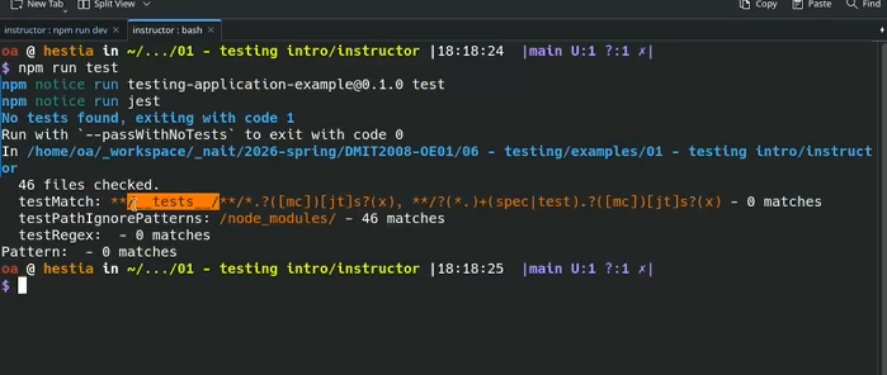
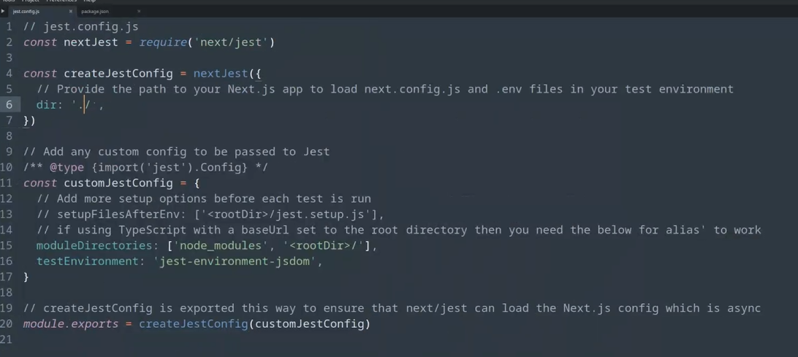
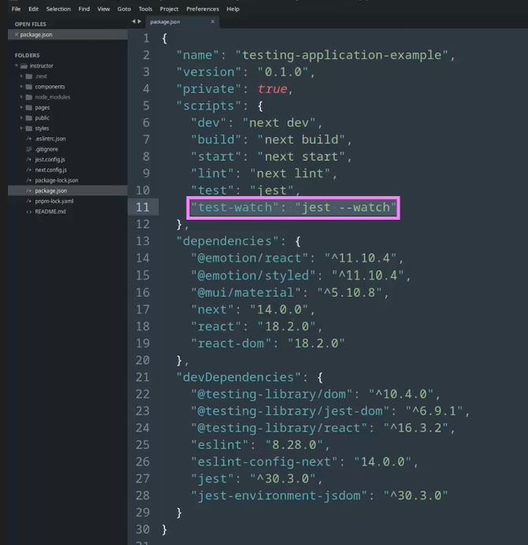
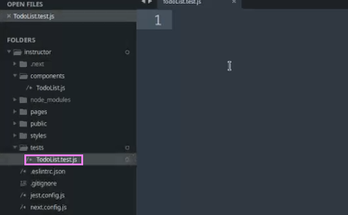
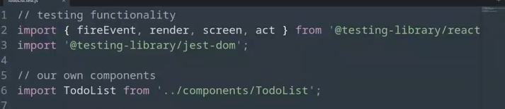
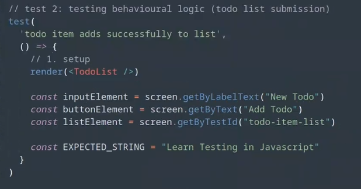
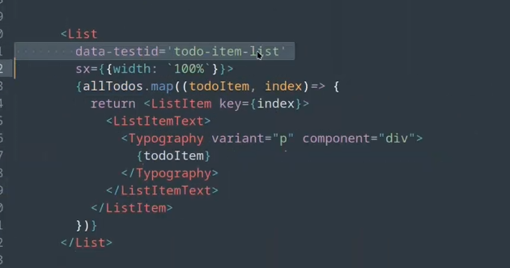

This is a [Next.js](https://nextjs.org/) project bootstrapped with [`create-next-app`](https://github.com/vercel/next.js/tree/canary/packages/create-next-app).

## Getting Started

First, run the development server:

```bash
npm run dev
# or
yarn dev
```

Open [http://localhost:3000](http://localhost:3000) with your browser to see the result.

You can start editing the page by modifying `pages/index.js`. The page auto-updates as you edit the file.

[API routes](https://nextjs.org/docs/api-routes/introduction) can be accessed on [http://localhost:3000/api/hello](http://localhost:3000/api/hello). This endpoint can be edited in `pages/api/hello.js`.

The `pages/api` directory is mapped to `/api/*`. Files in this directory are treated as [API routes](https://nextjs.org/docs/api-routes/introduction) instead of React pages.

## Learn More

To learn more about Next.js, take a look at the following resources:

- [Next.js Documentation](https://nextjs.org/docs) - learn about Next.js features and API.
- [Learn Next.js](https://nextjs.org/learn) - an interactive Next.js tutorial.

You can check out [the Next.js GitHub repository](https://github.com/vercel/next.js/) - your feedback and contributions are welcome!

## Deploy on Vercel

The easiest way to deploy your Next.js app is to use the [Vercel Platform](https://vercel.com/new?utm_medium=default-template&filter=next.js&utm_source=create-next-app&utm_campaign=create-next-app-readme) from the creators of Next.js.

Check out our [Next.js deployment documentation](https://nextjs.org/docs/deployment) for more details.


NOTES: 

jest = js + test
run the framework looks for tests 

jest .config.js  << basicallly this is the test im using / where the project lives >>

package.json 
npm run test
 

Watch Flag = watches for changes in the file - similar to hotReload

create new file: 

First grab your react functions, @testing-library/jest-dom. import components 
Skeleton test logic

test(
    'test name',
    () => {/* callback ()=>, the actual test logic */ }
)

THREE STAGES
// when we do a test we want ASSEMBLE / ACT / ACTION 
        || SETUP/GIVENS: establish expected result, gather neccessary parts, etc.
           ACT: fire any lgoic we are testing correct functionalit for
           ASSERT: compare/examine result

test(
    'toDo list title renders correctly',
    () => {
        1. setup 
            renders(<TodoList />)
            const titleElement = screen.getByText("Our Todo List")
        2. act - no logic to fire here, jsut the DOM extraction above
        3. assert
        expect(titleElement).toBeInTheDocument();
    }
)


// next - test that what is input actually happens 

// test 2: testing behavioural logic (todo list submission)
// test nono... testing too many things at once.. same with experiments... only one independent variable at a time



test(
    'todo items adds successfully to list',
    () => {
        //1. setup
        const // dif ways to swipe elements - make sure to give be specific item - ID for that element
        const // 
        const // see: data-test componenets in compponents todo list ** PREFFERED way of snipping elements : by some sort of id/attribute
        const 

        //2. act
        fireEvent.change(
            inputElement, // the element I want to fire a change event on
            change the event target value to a simulate string instead
            { object { value: EXPECTED_STRING }}
        )

        //3. assert
        expect(inputElement.value).toBe(EXPECTED_STRING)
    }

    act(() => {
        buttonElement.click()
    })

    assert
    expect(inputElement.value).toBe('')
    expect(listElement).toHaveTextContent(EXPECTED_STRING)
)


